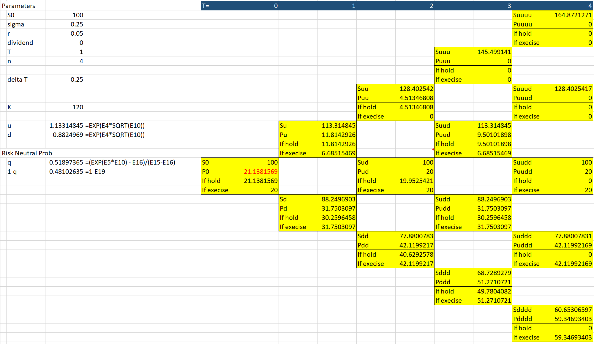

# Option Pricing  

This repository provides implementations of option pricing models, refactored and extended from an FNCE40009 Advanced Derivative Securities assignment.  
It is intended for students, researchers, and practitioners who wish to study option pricing and related derivatives modeling in Python.  

The implementation is built on **NumPy** and **SciPy** with emphasis on:  
- Code readability: functions are written to directly reflect equations from standard textbooks.  
- Computational efficiency: vectorized operations are used in place of explicit loops.  
- Extensibility: modular structure allows additional models and features to be incorporated.  

---

## Reference  

Most algorithms follow the approaches in:  

@book{mcdonald2013derivatives,
  title={Derivatives markets (3rd edition)},
  author={McDonald, Robert Lynch},
  year={2013},
  publisher={Pearson Education}
}

Additional references are noted below.  

---

## Binomial Tree Illustration  

    

  

---

## Black–Scholes–Merton (BSM)  

Usage: `example_BSM.py`  

Implemented functions and extensions:  
- European call: `call_value()` and put: `put_value()` (Chapter 12.1)  
- Garman–Kohlhagen Forex option class (Chapter 12.2)  
- Implied volatility under BSM: `implied_vol()` (Chapter 12.5)  
- Merton jump diffusion: `merton_jump_diffusion()` (Chapter 21.5)  
- Exotic barrier options: `cash_or_nothing_barrier_options()` (Chapter 22)  
- Greeks: `delta()`, `gamma()`, `theta()`, `vega()`, `rho()`, `psi()` (Appendix 12.B)  

---

## Monte Carlo Simulation  

Usage: `example_monte_carlo.py`  

Implemented methods:  
- Stock price simulation (Chapter 18 & 19.3): `stock_price_simulation()`  
- Jump diffusion with Poisson jumps (Chapter 19.8): `stock_price_simulation_with_poisson_jump()`  
- Stochastic interest rate models (work in progress):  
  - `vasicek()`  
  - `cox_ingersoll_ross_model()`  
- Stochastic volatility model: `heston()`  

Applications:  
- European call/put (Chapter 19.4)  
- Asian average price option (Chapter 14.2 & 19.4): `asian_avg_price()`  
- American option using Longstaff & Schwartz (2001) (Chapter 19.6): `american_option_longstaff_schwartz()`  
- Barrier options (Chapter 14 & 23): `barrier_option()`  
- Lookback option (Chapter 23, Exercise 23.12): `look_back_european()`  

---

## Example Tables  

Simulated stock prices:  

| Stock price S | h | 2h | 3h | ... | T-h | T |
|:-------------:|:--:|---:|---:|-----:|----:|---:|
| simulation 1  |    |    |    |     |     | S₁,T |
| simulation 2  |    |    |    |     |     | S₂,T |
| simulation 3  |    |    |    |     |     | S₃,T |
| ...           |    |    |    |     |     | ... |  

Stochastic interest rate (r):  

| Interest rate r | h | 2h | 3h | ... | T-h | T |
|:---------------:|:--:|---:|---:|-----:|----:|---:|
| simulation 1    |    |    |    |     |     | r₁,T |
| simulation 2    |    |    |    |     |     | r₂,T |
| simulation 3    |    |    |    |     |     | r₃,T |
| ...             |    |    |    |     |     | ... |  

Stochastic volatility (σ):  

| Volatility σ | h | 2h | 3h | ... | T-h | T |
|:------------:|:--:|---:|---:|-----:|----:|---:|
| simulation 1 |    |    |    |     |     | σ₁,T |
| simulation 2 |    |    |    |     |     | σ₂,T |
| simulation 3 |    |    |    |     |     | σ₃,T |
| ...          |    |    |    |     |     | ... |  

---

## Additional References  

- Merton, R. C. (1976). *Option pricing when underlying stock returns are discontinuous*. Journal of Financial Economics, 3(1–2), 125–144.  
- Garman, M. B., & Kohlhagen, S. W. (1983). *Foreign Currency Option Values*. Journal of International Money and Finance, 2, 231–237.  
- Longstaff, F. A., & Schwartz, E. S. (2001). *Valuing American options by simulation: a simple least-squares approach*. Review of Financial Studies, 14(1), 113–147.  

---
